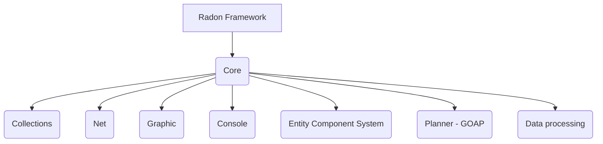
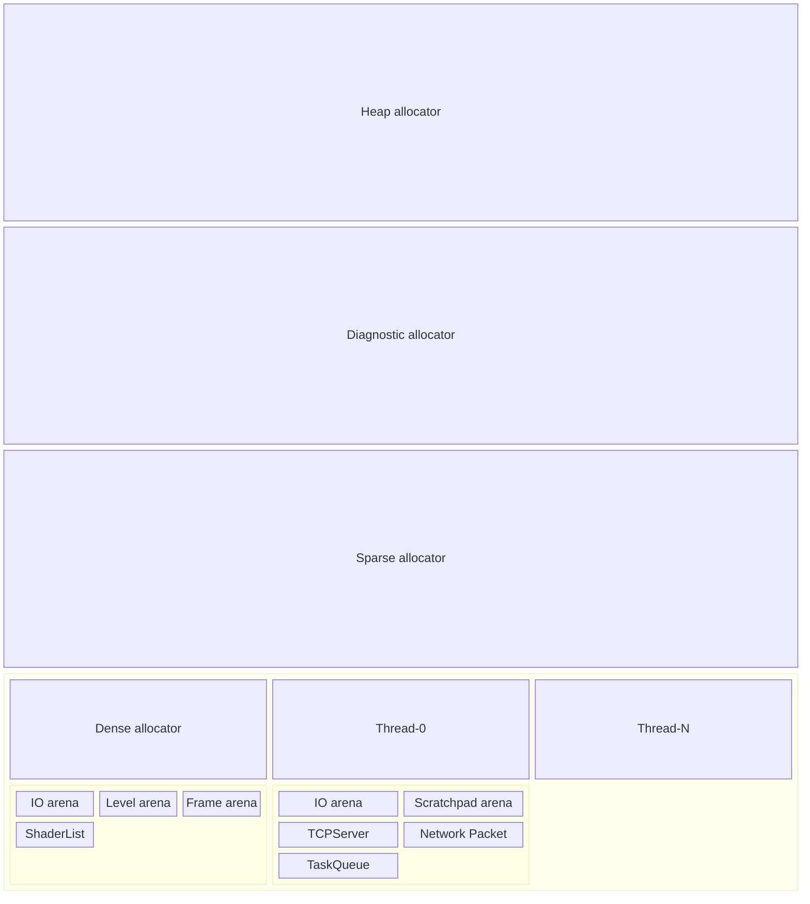

# Radon framework

Radon framework is a modern C++ framework for building optimized games and game-server. It is written in C++20 and uses the latest features of hardware. It has a modular architecture, which allows you to use only the parts that are needed for your project.

## Features
* concurrency (SIMD, many core in mind)
* fully deterministic behaviour by avoiding exceptions and use stack and avoid internal allocations
* no enforced memory management
  * provide OS API abstraction layer, memory block struct as common interface and arena to keep track of allocations
* Collections module to provide your own memory management
  * dynamic arrays, hash tables, linked lists, trees, etc.
* low level optimizations
  * runtime dispatcher, AVX/SSE..., cacheline alignment, etc.

## Memory management
The concept relies on the fact that we can reserve much more memory on a 64bit virtual address space and let the memory controller do the mapping of commited parts to the real memory. 
The idea of the memory management is to build an tree of allocators and arenas and assign the collectors to a specific arena they can work on. The allocator implement hardware and operating system level features like memory mapping. It also encourage you to tag your allocations for better debugging and diagnostics.

The Heap allocator is the primary allocator at the root. The purpose of the allocator is to reserve, commit, free and resize memory blocks by calling the operating system API. You can compose the allocator with additional allocator which add additonal features like a Diagnostic allocator which tracks metrics for better insights.
The Sparse allocator spread across the whole reserved memory and does commits by a binary partitioning to put as much as possible free space between the current and the next allocated block to avoid an expensive copy-move during a resize. There's also a Dense allocator which works in a linear fassion. This is usefull if you already know the memory budget and want to benefit from better caching.

Below the allocators are the arenas which implement more complex algorithm and more fine grained memory blocks. They are only aware of memory blocks. The allocator are using a different API compared to arenas. Each arena provides a tag which is passed to the allocator and can be used to lookup other arenas. The idea of arenas in this design are logical partitioning, using the knowledge of the application and let the user choose the best way to control it. They are meant to change the size rarely, grow in large blocks and shrink lazy(explicit request). They shouldn't rely on construction/destruction or freeing resources. The lifetime of the containing data are managed by the user.

Below the arenas are collections which are very fine grained container. They take control from you by managing the memory on their own but provide you peak performance for the task they are designed for. This is achieved because they manage the life-time and know the type of resource.

## Import past codebases to the new framework.
- [ ] basictypes
  - [x] atomics
  - [ ] character
  - [ ] float
  - [ ] integer
  - [ ] pointer
  - [ ] stringliteral
  - [ ] stringview
  - [ ] traits
- [ ] commontypes
  - [ ] atomics
  - [ ] pointer
  - [ ] rpmalloc
  - [ ] simd
  - [ ] string
  - [ ] traits
  - [ ] userliterals
- [ ] cpual
  - [ ] atomics
  - [ ] caches
  - [ ] codebuilder
  - [ ] design
  - [ ] dispatcher
  - [ ] features
  - [ ] memory
  - [ ] queue
  - [ ] worker
  - [ ] lowlevel/
  - [ ] instructions/
- [ ] gpual
- [ ] kissfs
- [ ] kisspt
  - [ ] envvars
  - [ ] library
  - [ ] process
  - [ ] tree
  - [ ] types
- [ ] rf
- [ ] rf-colorspace
- [ ] rf-console
- [ ] rf-diagnostics
- [ ] rf-cryptography
- [ ] rf-enterprise
- [ ] scrates
- [ ] nical